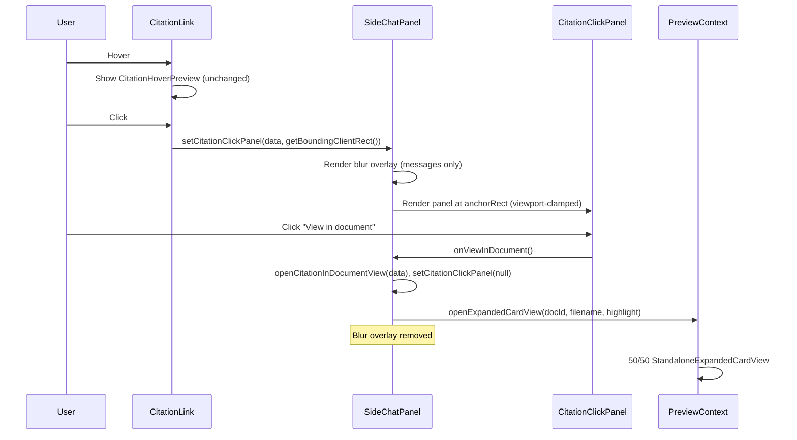

# Citation Click Preview Panel — Implementation Plan

## Objective

When the user **clicks** a citation number in chat, show a **compact citation preview panel** positioned **immediately to the right of the clicked citation**, with the **chat messages area slightly blurred** (chat input bar stays clear and interactive). **Hover** behavior stays unchanged (existing image-based hover preview). The **"View in document"** button performs the current citation-click behavior (open 50/50 document preview). UI must match the reference images exactly.

---

## 1. Behavior Summary

| Action                        | Current                            | New                                                        |
| ----------------------------- | ---------------------------------- | ---------------------------------------------------------- |
| Hover citation                | Show image hover preview (280×200) | **Unchanged**                                              |
| Click citation                | Open 50/50 document preview        | Show citation click panel next to citation + blur messages |
| Click "View in document"      | —                                  | Open 50/50 document preview (same as old click)            |
| Click "Ask follow up"         | —                                  | Prefill / follow-up flow (stub or implement)               |
| Agent-triggered citation open | Open 50/50                         | **Unchanged** (do not show small panel)                    |

---

## 2. Positioning Logic (Exact)

- **Anchor:** The citation **button** that was clicked (the `[1]`, `[2]`, etc. element).
- **Measure at click time:** In `CitationLink`’s `onClick`, call `e.currentTarget.getBoundingClientRect()` and pass this rect (or `{ left, top, right, bottom, width, height }`) up together with the citation data.
- **Panel placement:**
  - **Preferred:** Panel opens to the **right** of the citation with a small gap (e.g. 12px):  
  `panelLeft = rect.right + 12`, `panelTop = rect.top` (align panel top with citation top).  
  - **Viewport clamping:**
    - If `panelLeft + panelWidth > viewportWidth - margin`: place panel to the **left** of the citation: `panelLeft = rect.left - panelWidth - 12`.
    - If `panelTop < margin`: set `panelTop = margin` (e.g. 8px).
    - If `panelTop + panelHeight > viewportHeight - margin`: set `panelTop = viewportHeight - panelHeight - margin` so the panel stays on-screen.
  - **Panel dimensions:** Fixed width (e.g. 320–360px from reference). Max height (e.g. ~70vh) with internal scroll for content; height can be content-based up to that max.
- **Rendering:** Panel and overlay are rendered via **React portal** into `document.body` (or a stable root) so they are not clipped by chat panel overflow and z-index is predictable. Use `position: fixed` for both the **blur overlay** and the **citation panel**, with coordinates derived from the stored anchor rect.

---

## 3. Blur Overlay (Chat Only, Not Chat Bar)

- **Scope:** Blur **only the chat messages area**. The **chat input bar** (the row with "Ask anything...", Agent, GPT-4o mini, Map, Attach, Voice) must **not** be blurred and must remain fully interactive.
- **Implementation:**
  - **Option A (recommended):** When citation panel is open, render a **blur overlay** that covers exactly the **scrollable messages container** (the `div` with `ref={contentAreaRef}` and `className="flex-1 overflow-y-auto sidechat-scroll"`). That div already has `position: relative`. Add a **sibling** overlay div (or a portal that targets the same area) with `position: absolute`, `inset: 0`, `backdropFilter: 'blur(6px)'`, `WebkitBackdropFilter: 'blur(6px)'`, and a light tint e.g. `backgroundColor: 'rgba(255,255,255,0.3)'`, `pointerEvents: 'none'` so clicks pass through to close handlers on the panel. Ensure this overlay is **inside** the scrollable content wrapper so it does not cover the chat input (which is a **sibling** of that wrapper in the flex layout).
  - **Option B:** Render overlay in a portal, covering the full viewport, but with **bottom** set so it stops above the chat bar (e.g. measure or use a fixed min height for the input area so the overlay has `bottom: 80` or similar). This is more fragile if the chat bar height changes.
- **Z-index:** Blur overlay below the citation panel; citation panel above overlay so it stays clickable. Example: overlay `z-index: 10050`, citation panel `z-index: 10055`. Both above the chat content (which is in normal flow).
- **Click outside:** Clicking the overlay (if `pointerEvents: 'auto'` on overlay) or outside the panel should close the panel and remove the overlay. If overlay has `pointerEvents: 'none'`, attach a transparent “backdrop” div that only catches clicks (position fixed, full viewport, below panel, with `pointerEvents: 'auto'` and `onClick` to close).

---

## 4. UI Spec (Match Reference Images)

### 4.1 Container (Panel Card)

- **Background:** White `#FFFFFF`.
- **Border radius:** ~12px (rounded corners).
- **Shadow:** Subtle elevation, e.g. `boxShadow: '0 4px 20px rgba(0,0,0,0.08), 0 0 1px rgba(0,0,0,0.06)'`.
- **Size:** Width fixed (e.g. 340px). Max height ~70vh; content area scrollable with `overflow-y: auto`.
- **Padding:** Header and footer have padding; content section has padding and scrolls independently.

### 4.2 Header Section

- **Layout:** Single row: icon on the left, text block to the right.
- **File icon (left):**
  - Red/orange square icon with a white document/PDF symbol (e.g. Lucide `FileText` inside a rounded square with red/orange background `#DC2626` or `#EA580C`).
  - Size ~40×40px, left-aligned with ~12–16px margin from panel edge.
- **File name:**
  - Text: `citationData.original_filename` or fallback "Document".
  - Style: **Bold**, dark grey (e.g. `#1f2937` or `#374151`), font size ~15–16px.
- **Document type and page (below file name):**
  - One line: `"PDF Document - Page {N}"` (use "PDF" not "POF"). N = `citationData.page ?? citationData.bbox?.page ?? 1`.
  - Style: Lighter grey (e.g. `#6b7280`), smaller font ~12–13px, regular weight.
- **Alignment:** All header text left-aligned; icon and text block aligned to a common top baseline.

### 4.3 Content Preview Section

- **Source of text:** Use `(citationData as any).block_content ?? (citationData as any).cited_text`. If backend sends structured content (sections/headings), prefer that for a closer match to the reference; otherwise render a single block with the cited excerpt highlighted.
- **Cited excerpt highlight:**
  - The exact cited sentence/paragraph must have a **yellow background**, e.g. `backgroundColor: 'rgba(255, 235, 59, 0.45)'` or `#FEF08A` with sufficient contrast.
  - Optional: small yellow right-pointing triangle/arrow at the start of the highlighted paragraph (as in second reference image).
- **Typography:** Section headings (if present) in bold, dark grey; body text in regular weight, dark grey; readable line height (e.g. 1.5) and padding between sections.
- **Scrolling:** This section is the only scrollable part of the panel (`overflow-y: auto`, `flex: 1`, `minHeight: 0`).

### 4.4 Footer (Action Buttons)

- **Layout:** Two buttons in a row, full width (or with a small gap between).
- **"Ask follow up" (left):**
  - Light grey background (e.g. `#f3f4f6`), dark grey border (e.g. `1px solid #d1d5db`), dark grey text.
  - Icon: chat bubble (e.g. Lucide `MessageCircle` or `MessageSquare`) to the left of the label.
  - Rounded corners (e.g. 8px).
- **"View in document" (right):**
  - **Same visual style** as "Ask follow up" in the reference (light grey background, border, dark text) — not a solid primary button. Both buttons are secondary/outline style.
  - Rounded corners (e.g. 8px).
- **Behavior:** "View in document" calls the same logic as current citation click (open 50/50). "Ask follow up" can prefill the chat input with a question about the citation and close the panel, or be a stub.

---

## 5. Data and State

### 5.1 State in SideChatPanel

- **Citation panel open state:** e.g. `citationClickPanel: { citationData: CitationData; anchorRect: DOMRect } | null`.
  - When user clicks a citation (and not from agent): set this state with `citationData` and `anchorRect` from the clicked button’s `getBoundingClientRect()`.
  - When user clicks "View in document", "Ask follow up", or outside (backdrop): set to `null`.

### 5.2 Passing Anchor from CitationLink

- **Current:** `CitationLink` receives `onClick: (data: CitationDataType) => void` and calls `onClick(citationData)` on click.
- **Change:** Extend the callback to include anchor rect: e.g. `onClick: (data: CitationDataType, anchorRect: DOMRect) => void`. In `CitationLink`, in the button’s `onClick`, do:
  - `const rect = e.currentTarget.getBoundingClientRect();`
  - `onClick(citationData, rect);`
- **Parent (SideChatPanel):** The handler that currently calls `handleCitationClick` should, for **user** clicks, instead set `citationClickPanel` to `{ citationData, anchorRect }` and **not** call `openExpandedCardView`. For **agent-triggered** opens, keep calling the existing logic (open 50/50 directly).

### 5.3 Types

- Add `block_content?: string` and `cited_text?: string` to `CitationDataType` in SideChatPanel (or the shared type used for citations) so the panel can render text without `(citationData as any)`.

---

## 6. Routing Logic (No Bugs)

### 6.1 Extract “Open in 50/50” Logic

- In `SideChatPanel`, extract from `handleCitationClick` a **pure** function (or callback) that:
  1. Validates bbox (reuse existing `validateBbox`).
  2. Builds `highlightData` from `citationData` (same logic as today: new minimal structure first, then legacy `source_chunks_metadata` / `matched_chunk_metadata` / etc.).
  3. Performs panel expand / fullscreen logic (e.g. `setIsExpanded(true)`, `setDraggedWidth(null)`, fullscreen handling, `isFirstCitationRef`, `wasFullscreenBeforeCitationRef`).
  4. Calls `openExpandedCardView(docId, filename, highlightData, fromAgentAction)`.
  5. Sets `documentPreviewOwnerRef.current = currentChatIdRef.current || currentChatId`.
- Name it e.g. `openCitationInDocumentView(citationData: CitationData, fromAgentAction?: boolean)`.

### 6.2 When to Call What

- **CitationLink clicked (user):** Set `citationClickPanel = { citationData, anchorRect }`. Do **not** call `openCitationInDocumentView` (so 50/50 does not open on first click).
- **"View in document" clicked:** Call `openCitationInDocumentView(panelCitationData, false)`, then set `citationClickPanel = null` (close panel and blur).
- **Agent-triggered citation open (e.g. from reasoning step / tool):** Call `openCitationInDocumentView(citationData, true)` directly; do **not** set `citationClickPanel` (no small panel for agent).
- **handleCitationClick:** Can remain the entry for agent-triggered flows; for user clicks from the UI, the message render path should use the new handler that only sets `citationClickPanel`. Ensure `StreamingResponseTextMemo` / citation render path pass the new callback that receives `(data, anchorRect)` and that only the **citation number button** click uses that (not a duplicate path that still calls `handleCitationClick` with one argument).

### 6.3 Reasoning Steps (Agent)

- The logic that adds the “Opening citation view & Highlighting content” reasoning step when in agent mode should remain **only** when the 50/50 is about to open (e.g. inside `openCitationInDocumentView` when `fromAgentAction === false`, or keep it in the **"View in document"** path so it runs when user clicks "View in document"). Do **not** add that step when we only open the small panel (citation click).

---

## 7. Edge Cases and Robustness

- **Scroll:** When the user scrolls the chat, the citation moves but the panel is fixed. Either (a) close the panel on scroll (listen to `contentAreaRef` scroll and set `citationClickPanel = null`), or (b) keep the panel open at the same viewport position. Recommendation: **(a) close on scroll** so the panel doesn’t appear detached from the citation.
- **Resize:** On window resize, either close the panel or reposition it using the same anchor (if we stored only rect, it’s stale; so closing on resize is simpler).
- **Escape key:** `Escape` should close the panel and clear blur.
- **Same citation clicked again:** If the panel is already open for the same citation (same doc_id + same bbox/page), you can leave it as-is or refresh anchor position; otherwise replace with new citation and new anchor.
- **Panel overflow:** Always clamp panel position so it stays within viewport (see Positioning Logic above).
- **No block_content:** If `block_content` and `cited_text` are both missing, show a fallback line: e.g. “No preview text available” and still show “View in document”.
- **Z-index:** Panel and overlay above chat content and above any other in-panel popups (e.g. QuickStartBar); use values like 10050–10060 so they sit below modals if any (e.g. 10100+).

---

## 8. File and Component Structure

### 8.1 Where to Implement

- **Option A:** All in [SideChatPanel.tsx](frontend-ts/src/components/SideChatPanel.tsx): state, blur overlay, citation panel UI, `openCitationInDocumentView`, and updated citation click handler. Citation panel can be an inline component or a function component in the same file.
- **Option B:** New file [CitationClickPanel.tsx](frontend-ts/src/components/CitationClickPanel.tsx) for the panel UI only (props: `citationData`, `anchorRect`, `onViewInDocument`, `onAskFollowUp`, `onClose`). SideChatPanel still owns state, overlay, and positioning math; it passes props and renders the panel (via portal).

Recommendation: **Option B** for readability and reuse; panel is a presentational component.

### 8.2 Files to Touch

- [frontend-ts/src/components/SideChatPanel.tsx](frontend-ts/src/components/SideChatPanel.tsx):
  - Add state `citationClickPanel: { citationData: CitationData; anchorRect: DOMRect } | null`.
  - Add blur overlay (only over messages area) when `citationClickPanel !== null`.
  - Extract `openCitationInDocumentView` from `handleCitationClick`; use it for "View in document" and for agent-triggered opens.
  - Change citation click handler passed to message/citation render: for user clicks, call `(data, rect) => setCitationClickPanel({ citationData: data, anchorRect: rect })`; ensure CitationLink passes `anchorRect`.
  - Render `CitationClickPanel` (or inline panel) in a portal when `citationClickPanel !== null`, with position from `anchorRect` and viewport clamping.
  - Close panel on scroll (contentAreaRef), window resize, Escape, backdrop click, "View in document", "Ask follow up".
- [frontend-ts/src/components/SideChatPanel.tsx](frontend-ts/src/components/SideChatPanel.tsx) (CitationLink):
  - Update `onClick` signature to pass `anchorRect`: `onClick(citationData, e.currentTarget.getBoundingClientRect())`.
- New (optional): [frontend-ts/src/components/CitationClickPanel.tsx](frontend-ts/src/components/CitationClickPanel.tsx): panel UI as above (header, content with highlight, footer buttons).
- Types: add `block_content` and `cited_text` to `CitationDataType` (in SideChatPanel or shared types).

---

## 9. Checklist Before Merge

- Clicking a citation opens the small panel to the right of the citation (or left if no space); no 50/50 open on first click.
- Messages area is blurred; chat input bar is not blurred and remains usable.
- "View in document" opens 50/50 with correct highlight and panel expand logic.
- Agent-triggered citation still opens 50/50 directly (no small panel).
- Hover preview is unchanged (image-based, same delay and content).
- Panel closes on: "View in document", "Ask follow up", backdrop click, Escape, scroll, window resize.
- Panel and overlay do not overflow viewport; panel is clamped.
- UI matches reference: red/orange file icon, bold filename, "PDF Document - Page N", yellow-highlighted excerpt, two secondary-style buttons with correct order and icons.
- No duplicate reasoning steps; “Opening citation view” step only when 50/50 actually opens (e.g. from "View in document" or agent).

---

## 10. Flow Diagram

This plan is sufficient to implement the feature with exact UI and positioning and without regressions.