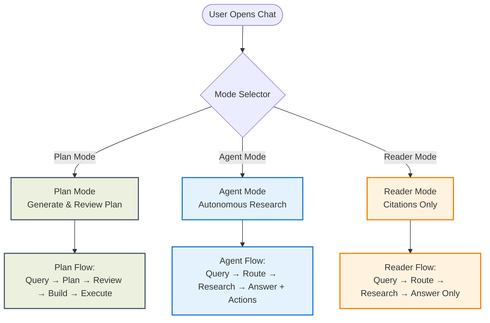
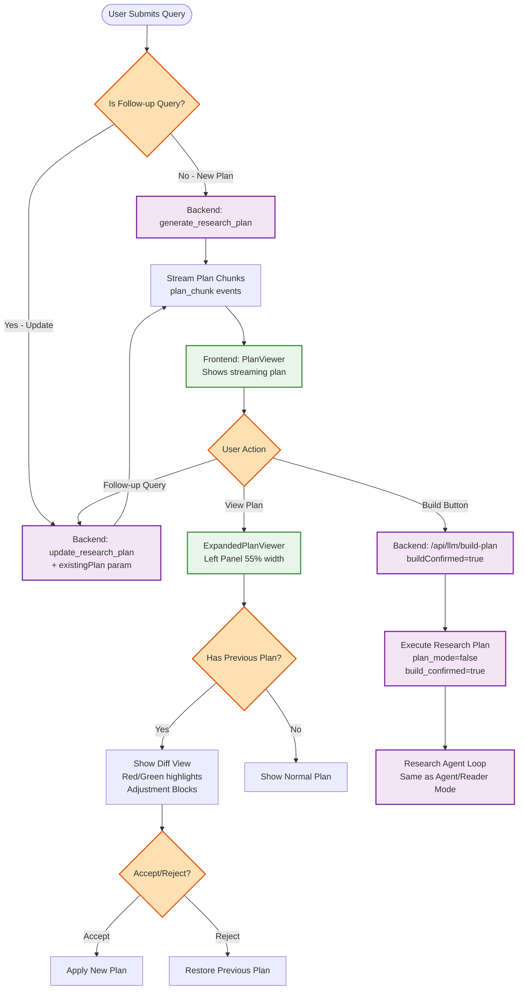
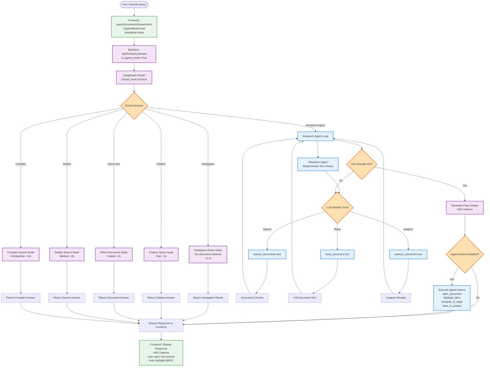
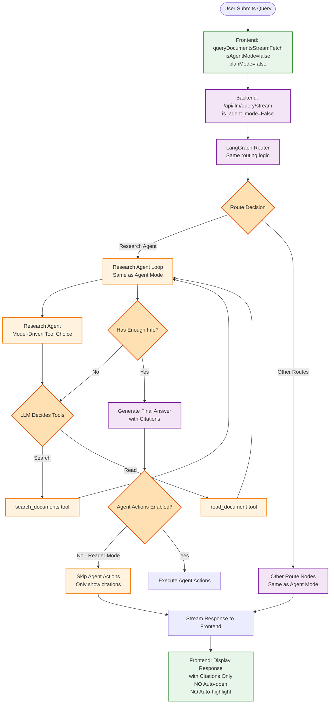
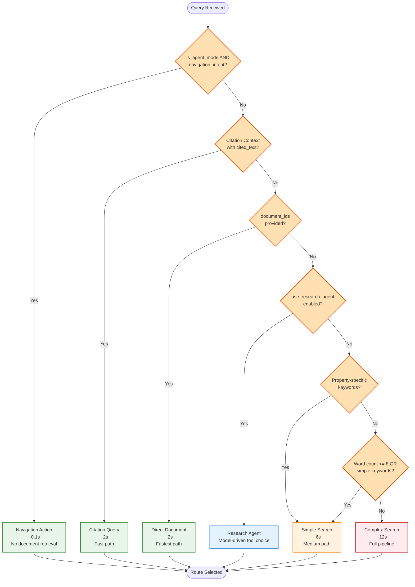

# Mode Architecture Diagram

## Overview

This document provides detailed visual diagrams of how **Plan Mode**, **Agent Mode**, and **Reader Mode** work in the SoloSway application. The architecture is broken down into focused diagrams for better clarity.

### High-Level Mode Selection



---

## Plan Mode

### Purpose
Generate and review research plan before execution.

### Flow
Query → Generate Plan → Review/Edit → Build → Execute

### Features
- Plan streaming with typing animation
- Plan updates with diff view (red/green)
- Adjustment blocks showing changes
- Expanded plan panel (left side, 55% width)
- Accept/Reject changes
- Build button to execute plan

### Detailed Flow Diagram



### Plan Mode Execution
When "Build" is clicked:
1. `buildConfirmed=True` is sent to backend
2. Plan mode is disabled (`plan_mode=False`)
3. Normal research agent execution begins
4. Same tool calling and answer generation as Agent/Reader modes

---

## Agent Mode

### Purpose
Autonomous research with proactive document actions.

### Flow
Query → Route → Research Agent → Tool Calls → Answer + Actions

### Features
- Model-driven tool choice (LLM decides tools)
- Auto-open documents
- Auto-highlight BBOX
- Navigation actions
- Save to projects
- Full agent action capabilities

### Detailed Flow Diagram



---

## Reader Mode

### Purpose
Research with citations only (no auto-actions).

### Flow
Query → Route → Research Agent → Tool Calls → Answer (citations only)

### Features
- Same research capabilities as Agent Mode
- Model-driven tool choice
- Citations displayed
- **NO** auto-open documents
- **NO** auto-highlight
- **NO** navigation actions
- User manually clicks citations

### Detailed Flow Diagram



### Key Difference from Agent Mode
Both Agent and Reader modes use the same research agent, but:
- **Agent Mode**: `is_agent_mode=True` → Agent actions enabled
- **Reader Mode**: `is_agent_mode=False` → Agent actions disabled

---

## Routing Logic

The `should_route` function in `main_graph.py` routes queries based on query type, context, and mode settings.

### Routing Decision Tree



### Routing Factors

The routing decision considers:
- `is_agent_mode`: Enables agent actions and navigation
- `use_research_agent`: Routes to model-driven tool choice
- Query type: Navigation, Citation, Direct Doc, Simple, Complex
- Context: `citation_context`, `document_ids`, `property_id`
- Query complexity: Word count, keywords, property-specific terms

### Route Types

| Route | Speed | Description |
|-------|-------|-------------|
| Navigation Action | ~0.1s | Navigation queries in agent mode (no document retrieval) |
| Citation Query | ~2s | User clicked citation and asked question |
| Direct Document | ~2s | User attached specific document(s) |
| Simple Search | ~6s | Simple queries (≤8 words or simple keywords) |
| Complex Search | ~12s | Complex queries requiring full pipeline |
| Research Agent | Variable | Model-driven tool choice (LLM decides tools) |

---

## Research Agent Loop

The research agent uses model-driven tool choice, allowing the LLM to autonomously decide which tools to call and in what order.

### Agent Loop Flow

```mermaid
flowchart TB
    Start([Research Agent Started]) --> InitContext[Create Retrieval Context<br/>from state]
    
    InitContext --> CreateTools[Create Tools<br/>search_documents<br/>read_document<br/>analyze_document]
    
    CreateTools --> BindLLM[Bind LLM with Tools<br/>tool_choice="auto"]
    
    BindLLM --> BuildMessages[Build Initial Messages<br/>System Prompt + User Query<br/>+ Conversation History]
    
    BuildMessages --> AgentLoop[Agent Loop<br/>Iteration N]
    
    AgentLoop --> CallLLM[Call LLM<br/>with current messages]
    
    CallLLM --> CheckResponse{LLM Response Type?}
    
    CheckResponse -->|Tool Call| ExecuteTool[Execute Tool<br/>search/read/analyze]
    CheckResponse -->|Final Answer| CheckEnough{Has Enough Info?}
    
    ExecuteTool --> GetResults[Get Tool Results]
    GetResults --> AddToolMessage[Add ToolMessage<br/>to conversation]
    
    AddToolMessage --> CheckIteration{Max Iterations<br/>or Timeout?}
    
    CheckIteration -->|No| AgentLoop
    CheckIteration -->|Yes| ForceAnswer[Force Final Answer]
    
    CheckEnough -->|No| AddToolMessage
    CheckEnough -->|Yes| GenerateFinal[Generate Final Answer<br/>with Citations]
    
    ForceAnswer --> GenerateFinal
    
    GenerateFinal --> ExtractActions{Extract Agent Actions<br/>from response}
    
    ExtractActions --> CheckMode{is_agent_mode?}
    
    CheckMode -->|Yes| ExecuteActions[Execute Agent Actions<br/>open_document<br/>highlight_bbox<br/>navigate_to_page<br/>save_to_project]
    CheckMode -->|No| SkipActions[Skip Agent Actions<br/>Reader Mode]
    
    ExecuteActions --> ReturnResult[Return Result:<br/>final_summary<br/>citations<br/>agent_actions<br/>tool_calls_made]
    SkipActions --> ReturnResult
    
    ReturnResult --> End([Agent Complete])
    
    classDef agentMode fill:#E3F2FD,stroke:#1976D2,stroke-width:2px
    classDef tool fill:#F3E5F5,stroke:#7B1FA2,stroke-width:2px
    classDef decision fill:#FFE0B2,stroke:#E65100,stroke-width:2px
    classDef action fill:#E8F5E9,stroke:#388E3C,stroke-width:2px
    
    class AgentLoop,CallLLM,GenerateFinal agentMode
    class CreateTools,ExecuteTool,GetResults tool
    class CheckResponse,CheckEnough,CheckIteration,ExtractActions,CheckMode decision
    class ExecuteActions,SkipActions action
```

### Tool Types

The research agent can call these tools:

1. **search_documents**: Search for relevant document chunks
   - Returns: Document chunks with relevance scores
   - Use case: Finding relevant documents for query

2. **read_document**: Read full document text
   - Returns: Complete document content
   - Use case: Getting full context from specific document

3. **analyze_document**: Analyze document structure/content
   - Returns: Analysis results
   - Use case: Understanding document structure or extracting specific information

### Agent Configuration

- **Max Iterations**: Configurable limit on tool call iterations
- **Timeout**: Total timeout for agent execution
- **Tool Timeout**: Per-tool timeout (30s fixed)
- **Fallback**: Falls back to fixed pipeline on error

### Stopping Conditions

The agent loop stops when:
1. LLM generates final answer (no more tool calls)
2. Maximum iterations reached
3. Timeout exceeded
4. Error occurs (with fallback)

---

## Key Differences Summary

### Plan Mode
- **Purpose**: Generate and review research plan before execution
- **Flow**: Query → Generate Plan → Review/Edit → Build → Execute
- **Unique Features**:
  - Plan streaming with typing animation
  - Plan updates with diff view (red/green)
  - Adjustment blocks showing changes
  - Expanded plan panel (left side, 55% width)
  - Accept/Reject changes
  - Build button to execute plan

### Agent Mode
- **Purpose**: Autonomous research with proactive document actions
- **Flow**: Query → Route → Research Agent → Tool Calls → Answer + Actions
- **Unique Features**:
  - Model-driven tool choice (LLM decides tools)
  - Auto-open documents
  - Auto-highlight BBOX
  - Navigation actions
  - Save to projects
  - Full agent action capabilities

### Reader Mode
- **Purpose**: Research with citations only (no auto-actions)
- **Flow**: Query → Route → Research Agent → Tool Calls → Answer (citations only)
- **Unique Features**:
  - Same research capabilities as Agent Mode
  - Model-driven tool choice
  - Citations displayed
  - **NO** auto-open documents
  - **NO** auto-highlight
  - **NO** navigation actions
  - User manually clicks citations

---

## Technical Details

### Backend Routing
The `should_route` function in `main_graph.py` routes queries based on:
- `is_agent_mode`: Enables agent actions and navigation
- `use_research_agent`: Routes to model-driven tool choice
- Query type: Navigation, Citation, Direct Doc, Simple, Complex

### Research Agent Loop
Both Agent and Reader modes use the same research agent, but:
- **Agent Mode**: `is_agent_mode=True` → Agent actions enabled
- **Reader Mode**: `is_agent_mode=False` → Agent actions disabled

### Plan Mode Execution
When "Build" is clicked:
1. `buildConfirmed=True` is sent to backend
2. Plan mode is disabled (`plan_mode=False`)
3. Normal research agent execution begins
4. Same tool calling and answer generation as Agent/Reader modes
