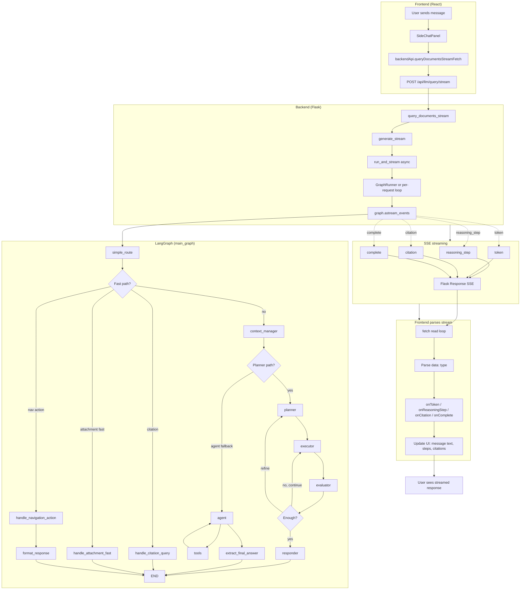

# How responses are generated

End-to-end flow from user message to streamed answer in the app.

## Sequence (stream path)

1. **User** submits a query in **SideChatPanel**.
2. **Frontend** calls `backendApi.queryDocumentsStreamFetch()` with:
   - `query`, `propertyId`, `messageHistory`, `sessionId`
   - callbacks: `onToken`, `onComplete`, `onReasoningStep`, `onCitation`, etc.
3. **Backend** receives `POST /api/llm/query/stream`:
   - Builds `initial_state` (query, session_id, document_ids, attachment_context, etc.).
   - Starts **generate_stream()**, which runs **run_and_stream()** in a background thread (or reuses **GraphRunner**’s event loop).
4. **run_and_stream()**:
   - Optionally gets or creates a **checkpointer** and **graph** (shared DB or per-request).
   - Runs **graph.astream_events(initial_state, config)** and consumes the async event stream.
5. **Graph execution**:
   - **simple_route** sends the request to a fast path (citation, attachment fast, nav) or into **context_manager**.
   - Main path: **planner** → **executor** (tools) → **evaluator** → either loop back (executor/planner) or go to **responder** (or **agent** fallback → **tools** → **extract_final_answer**).
   - **Responder** (or summarization path) produces **final_summary**; the stream logic reads this from events/state and yields **token** SSE events.
6. **SSE**:
   - For each event, the backend yields `data: {"type": "reasoning_step"|"token"|"citation"|"execution_event"|"complete"|...}\n\n`.
   - **Tokens** are the actual response text; **reasoning_step** drives “Preparing…”, “Reading…”, “Summarising…” etc.
7. **Frontend**:
   - Reads the response body with `response.body.getReader()` and decodes chunks.
   - Splits on `\n`, parses `data: {...}` and dispatches by `type` to **onToken**, **onReasoningStep**, **onCitation**, **onComplete**, etc.
   - **SideChatPanel** buffers tokens, runs **processTokensWithDelay** for incremental markdown, and updates the message list so the user sees the answer stream in.

## Key files

| Layer        | File(s) |
|-------------|---------|
| Frontend UI | `frontend-ts/src/components/SideChatPanel.tsx` |
| API client  | `frontend-ts/src/services/backendApi.ts` (`queryDocumentsStreamFetch`) |
| Stream endpoint | `backend/views.py` (`/api/llm/query/stream`, `generate_stream`, `run_and_stream`) |
| Graph + routing | `backend/llm/graphs/main_graph.py` |
| Graph runner | `backend/llm/runtime/graph_runner.py` |
| Responder / agent | `backend/llm/nodes/responder_node.py`, `backend/llm/nodes/agent_node.py` |

## Observability

For request timing, LangGraph step logging, and LangSmith tracing, see [Observability](observability.md).
